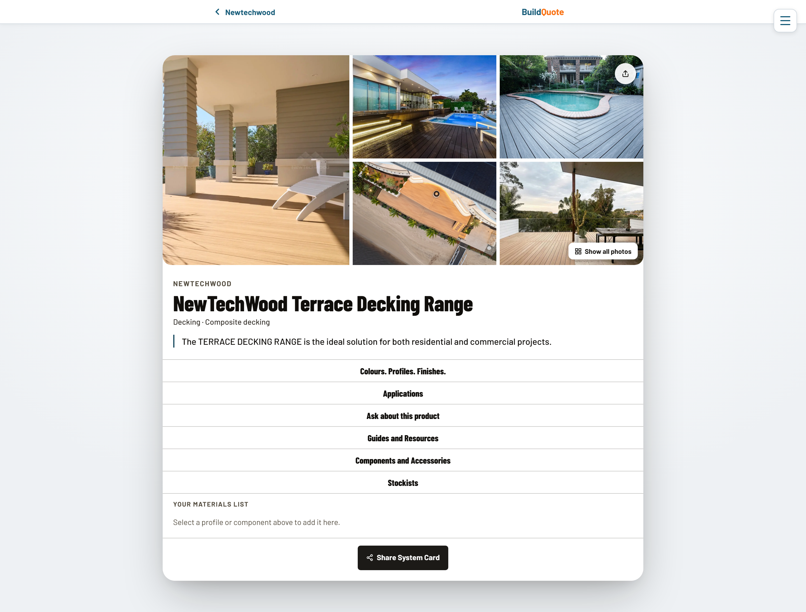

# BuildQuote — Library & Request for Quotation


Turns a handwritten or uploaded materials list into a professional multi-format
Request for Quotation (RFQ) — sent straight to a supplier — plus a public,
searchable product library builders can quote straight from.

Built for Southwest WA builders; the pattern generalises to any trade where
someone turns a messy list into a structured supplier quote request.



---

## Why fork this

- **AI OCR/parse in one API route:** photo, PDF, spreadsheet, or typed/voice list
  in → structured line items out (`/api/parse`, OpenAI `gpt-4o`). No separate OCR
  service to stand up.
- **One send, three formats:** a single `/api/send` call builds the HTML email,
  a branded PDF, and a CSV, and dispatches via Resend — reusable pattern for any
  "structured data → email + attachments" flow.
- **Public product library — real, working mechanism, demo data for now:**
  search/filter a product catalogue, build a shopping list (localStorage-backed,
  no login required), share it as a PNG, then one click converts it straight
  into an RFQ draft. The library here runs on a small set of demo companies,
  not live manufacturer data — see [Open source status](#open-source-status).
- Draft-based RFQ flow (`?draft=<uuid>` in the URL, no hidden localStorage state)
  is a clean, resumable, shareable pattern for any multi-step form.

---

## About the creator

I spent a year working in administration at a local hardware supply store.
Answering a customer enquiry — by phone, email, or in person — often meant
drawing on several separate sources for the same product: a printed
catalogue, the manufacturer's website, our point-of-sale system. Each held
part of the picture.

When I later had time between roles, I used it to think through a solution: what if a product's complete system information — profiles,
specifications, install guides, components, everything — lived in one
structured source?

Australian building materials manufacturers reach the market through a wide mix of channels — websites,
printed brochures, product packaging, QR codes, flyers, take-cards, sample
boards, printed PDFs, and staff training. Each does its job well for its own
purpose. What [Data Studio](https://github.com/buildquoteau-jpg/BuildQuote-Manufacturer-Data-Studio)
aims to do is take that same information — wherever it currently lives — and
format it into one consistent, human-readable and machine-readable structure
that works across many categories of Australian building products.

I'm not a technical person by background. I educated myself on the latest
developments in AI-assisted technology by listening to podcasts, then
experimenting — taking what I'd learned and applying it directly to build. I
found this way of learning and building particularly suited me; there's
something about how AI-assisted development works that I connect with and
understand instinctively. It gave me a way to take the systems and solutions
that had existed only in my head and actually build working prototypes of
them.

Every part of the design and architecture across all three repositories —
not just the System Card itself, but how each system works and how they
connect — is my own, directed decision by decision at every step. There's a
real temptation, working this way, to keep iterating, pivoting, and adding
features indefinitely. Part of choosing to open-source this now is
recognising that process could continue forever — I'd rather ship something
genuinely useful than keep chasing a perfect result that never ships.

I think the timing is right, for three reasons: Inside the three GIT repositories I have designed, manufacturers retain control
of verifying their own data, the resulting data container is
modular and portable, and — particularly with the machine-readable layer I've
added most recently — AI agents can directly access verified, structured product data at scale.

I'm releasing this openly so it can reach the people it was built for —
manufacturers, suppliers, builders, and system developers working in related digital spaces.
An individual business may adopt the full system or select the components of the code and
architecture that align with, and enhance, the digital direction their own company is heading.

If you do put any part of this to use, I'd welcome hearing about it —
feedback from real-world use would be genuinely valuable.

**— Melia Knapp** · [meliagrace@gmail.com](mailto:meliagrace@gmail.com)

## Try it live

This isn't run as an open public service — it's a showcase of what's possible,
built so other people and companies can see it, fork it, and run it
themselves.

- **[buildquote.com.au/library](https://buildquote.com.au/library)** — open
  to everyone, no account needed. Browse the demo product library and build a
  shopping list.
- **[buildquote.com.au/register](https://buildquote.com.au/register)** — free,
  open self-serve signup for a Builder account. Sign up yourself to walk the
  full RFQ flow — upload a list, get it parsed, and send a real RFQ.
- **[search.buildquote.com.au](https://search.buildquote.com.au)** (Trade
  Desk) and **[studio.buildquote.com.au](https://studio.buildquote.com.au)**
  (Data Studio) are **not** open self-serve — supplier and manufacturer
  accounts are created manually to keep a lid on the AI/processing costs
  those flows can trigger if left open to the public. Email
  [meliagrace@gmail.com](mailto:meliagrace@gmail.com) for a demo login, or
  fork the repo and run it on your own infrastructure to try the full thing
  yourself.

---

## Who this is for

### Builders
- Start a quote request from scratch
  ([`/rfq`](https://buildquote.com.au/rfq)), from a saved job, from a saved
  supplier, or resume a draft — five different entry points into the same flow.
- Upload a photo of a handwritten list, a PDF, a spreadsheet, or just type/speak
  it — AI turns it into an editable, structured line-item table.
- Send one RFQ email that already includes a print-ready PDF and an
  Excel-importable CSV, without building either by hand.
- **Just this piece:** the [`/rfq`](https://buildquote.com.au/rfq) wizard alone
  works as a standalone "structured materials list → email + PDF + CSV" tool,
  even without ever touching the product library.

### Anyone browsing products (no login required)
- Search/filter a public library of manufacturer systems
  ([`/library`](https://buildquote.com.au/library)) — the same shape of data
  **Data Studio** publishes as verified System Cards, currently populated with
  demo companies rather than live manufacturer data.
- Build a shopping list, share it as an image, or convert it directly into a
  pre-filled RFQ draft.
- **Just this piece:** [`/library`](https://buildquote.com.au/library) is
  public and unauthenticated — usable as a standalone product-search/
  spec-reference surface even by someone who never sends an RFQ.

### Suppliers
- Don't use this repo directly — they're the *recipients* of what it sends. What
  matters to a supplier: their directory listing and RFQ inbox live in
  **[Trade Desk](https://search.buildquote.com.au)**, and the account/reply-to
  details in the email come straight from what the builder filled in here.

### Manufacturers
- Also indirect — what shows up in
  [`/library`](https://buildquote.com.au/library) is exactly what a
  manufacturer published in **Data Studio**; nothing about a product's data is
  editable here.

---

## How the three BuildQuote repos fit together

```
Data Studio          →   published System Card + knowledge.jsonld
                            │
                            ▼
                shared production Supabase
                            │
        ┌───────────────────┴───────────────────┐
        ▼                                         ▼
  This repo (buildquote.com.au)            Trade Desk (search.buildquote.com.au)
  /library renders the card,               supplier directory + supplier's
  shopping list → "Convert to RFQ"         own listing/RFQ inbox
        │                                         ▲
        └──── builder picks a supplier ───────────┘
              from the Trade Desk directory,
              RFQ email sent from here
```

- **This repo is the only one that sends an RFQ.** It reads catalogue data
  published by Data Studio and supplier info surfaced via Trade Desk, but owns
  the entire builder-facing flow end to end.
- **`/library` → `/rfq`:** "Convert to RFQ" creates a draft
  (`/api/create-draft` → `/api/save-draft-items`) and redirects to `/rfq?draft=`,
  so the shopping list and the RFQ wizard share the same draft record.
- **Supplier Directory link:** points out to Trade Desk
  (`search.buildquote.com.au/supplierdirectory`) rather than duplicating supplier
  data here.

## Live product surfaces

- [buildquote.com.au](https://buildquote.com.au) — this app
- [buildquote.com.au/library](https://buildquote.com.au/library) — public product
  library (this app)
- [search.buildquote.com.au](https://search.buildquote.com.au) — supplier
  directory + supplier portal (Trade Desk)
- [studio.buildquote.com.au](https://studio.buildquote.com.au) — manufacturer
  data ingestion (Data Studio)

---

## The invisible drawer, made visible

> ⚠️ **None of the current demo products have this feature turned on yet.**
> It's the newest layer of the System Card. Everything below is built from
> the real code (`buildSystemKnowledge.ts`), for a fictional product — BQ
> CladMax, from a fictional manufacturer, Southline Building Products — so
> nothing here is mistaken for real production data.

**Why this is built the way it is** — the things that actually matter if
you're grounding or training an agent on Australian building-material data:

- **Every fact traces to a source** — the exact document and page number,
  and for lower-confidence extractions, the verbatim quote it came from.
  Nothing is asserted without a citation trail.
- **Confidence and trust level on every fact** — `bq:trustLevel` and
  `bq:epistemicStatus` distinguish a manufacturer-verified fact from a raw
  AI extraction, so an agent (or the team building one) knows exactly how
  much weight to give each one.
- **Disputed facts are shipped, not hidden.** A fact under dispute (see the
  acoustic rating below) still appears in the agent-facing layer, correctly
  flagged, with an `answerPolicy` telling an agent to cite it as unconfirmed
  rather than silently disappearing or being asserted as fact.
- **Explicit negative constraints** — not just what a product does, but what
  it must never be used for and why (`bq:incompatibleWith`), and warranty
  conditions tied to specific installation requirements. This is exactly the
  kind of data that's usually locked inside a PDF, if it exists at all.
- **Standard vocabulary, not a private format** — schema.org where it
  fits, a documented `bq:` extension only where construction relationships
  have no standard equivalent (see `/ns/v1`).
- **An explicit data licence block** (`bq:dataLicence`) states exactly what
  an agent is and isn't allowed to do with the data — search, retrieval,
  training, redistribution — per product, not buried in a terms-of-service
  page somewhere else.

This is exactly what an AI agent receives when it reads this System Card —
every fact, its verification status, and where it came from. In the real
app (the **Agent Ready** tab), this shows as two panels: the JSON-LD itself
as a collapsible "layered reveal" tree — top level open, deeper nesting
folded away until clicked — and the same data again as human-readable
markdown underneath.

<details>
<summary><strong>JSON-LD (the actual blob)</strong> — layered reveal</summary>

```json
{
  "@context": "https://studio.buildquote.com.au/ns/v1",
  "@id": "https://studio.buildquote.com.au/cards/southline-building-products/bq-cladmax-cladding-system",
  "@type": [
    "bq:ConstructionSystem",
    "Product"
  ],
  "bq:format": "buildquote-knowledge-object",
  "bq:formatVersion": "1.0",
  "bq:generatedAt": "2026-08-30T04:12:00.000Z",
  "bq:canonicalUrl": "https://studio.buildquote.com.au/cards/southline-building-products/bq-cladmax-cladding-system",
  "bq:customerCardUrl": "https://buildquote.com.au/library/southline-building-products/bq-cladmax-cladding-system",
  "name": "BQ CladMax Cladding System",
  "sku": "BQCM-SYS",
  "category": "Cladding > Fibre Cement",
  "description": "Vertically jointed fibre cement cladding system for residential and light commercial facades, available in standard and wide-board profiles with a factory-primed, paint-ready finish.",
  "manufacturer": {
    "@type": "Organization",
    "@id": "https://studio.buildquote.com.au/manufacturers/southline-building-products",
    "name": "Southline Building Products",
    "identifier": {
      "@type": "PropertyValue",
      "propertyID": "ABN",
      "value": "55 123 456 789"
    },
    "url": "https://southlinebp.example.com.au"
  },
  "bq:contains": [
    {
      "@type": [
        "bq:SystemProfile",
        "Product"
      ],
      "@id": "#profile-180",
      "name": "BQ CladMax 180 Board",
      "sku": "BQCM-180-3000",
      "bq:isPrimarySellableUnit": true,
      "length": {
        "@type": "QuantitativeValue",
        "value": 3000,
        "unitCode": "MMT"
      },
      "width": {
        "@type": "QuantitativeValue",
        "value": 180,
        "unitCode": "MMT"
      },
      "thickness": {
        "@type": "QuantitativeValue",
        "value": 8,
        "unitCode": "MMT"
      },
      "weight": {
        "@type": "QuantitativeValue",
        "value": 13.4,
        "unitCode": "KGM"
      },
      "bq:sellUnit": "each",
      "bq:supplierPack": {
        "quantity": 20,
        "unit": "boards/pack"
      }
    },
    {
      "@type": [
        "bq:SystemProfile",
        "Product"
      ],
      "@id": "#profile-300",
      "name": "BQ CladMax 300 Wide Board",
      "sku": "BQCM-300-3000",
      "bq:isPrimarySellableUnit": true,
      "length": {
        "@type": "QuantitativeValue",
        "value": 3000,
        "unitCode": "MMT"
      },
      "width": {
        "@type": "QuantitativeValue",
        "value": 300,
        "unitCode": "MMT"
      },
      "thickness": {
        "@type": "QuantitativeValue",
        "value": 8,
        "unitCode": "MMT"
      },
      "weight": {
        "@type": "QuantitativeValue",
        "value": 22.1,
        "unitCode": "KGM"
      },
      "bq:sellUnit": "each",
      "bq:supplierPack": {
        "quantity": 12,
        "unit": "boards/pack"
      }
    },
    {
      "@type": [
        "bq:SystemProfile",
        "Product"
      ],
      "@id": "#profile-soffit",
      "name": "BQ CladMax Soffit Lining 4.5mm",
      "sku": "BQCM-SOF-4500",
      "bq:isPrimarySellableUnit": true,
      "length": {
        "@type": "QuantitativeValue",
        "value": 1800,
        "unitCode": "MMT"
      },
      "width": {
        "@type": "QuantitativeValue",
        "value": 1200,
        "unitCode": "MMT"
      },
      "thickness": {
        "@type": "QuantitativeValue",
        "value": 4.5,
        "unitCode": "MMT"
      },
      "bq:sellUnit": "sheet"
    }
  ],
  "bq:requires": [
    {
      "@type": [
        "bq:Component",
        "Product"
      ],
      "@id": "#comp-batten",
      "name": "BQ CladMax Vertical Jointing Batten",
      "sku": "BQCM-VJB-3000",
      "description": "Factory-grooved PVC jointing batten — sets the 8mm shadow-line joint.",
      "category": "Jointing",
      "bq:componentRole": "required"
    },
    {
      "@type": [
        "bq:Component",
        "Product"
      ],
      "@id": "#comp-starter",
      "name": "BQ CladMax Starter Track",
      "sku": "BQCM-ST-3000",
      "description": "Base-of-wall aluminium starter track — sets the first board level and provides the required drainage gap.",
      "category": "Trim",
      "bq:componentRole": "required"
    }
  ],
  "bq:optionalComponent": [
    {
      "@type": [
        "bq:Component",
        "Product"
      ],
      "@id": "#comp-cornerext",
      "name": "BQ CladMax External Corner Trim",
      "sku": "BQCM-COE-3000",
      "category": "Trim",
      "bq:componentRole": "optional"
    },
    {
      "@type": [
        "bq:Component",
        "Product"
      ],
      "@id": "#comp-cornerint",
      "name": "BQ CladMax Internal Corner Trim",
      "sku": "BQCM-COI-3000",
      "category": "Trim",
      "bq:componentRole": "optional"
    },
    {
      "@type": [
        "bq:Component",
        "Product"
      ],
      "@id": "#comp-controljoint",
      "name": "BQ CladMax Vertical Control Joint",
      "sku": "BQCM-CJ-3000",
      "description": "Required at maximum 6m board runs to accommodate movement.",
      "category": "Trim",
      "bq:componentRole": "optional"
    }
  ],
  "bq:accessory": [
    {
      "@type": [
        "bq:Component",
        "Product"
      ],
      "@id": "#comp-fixings",
      "name": "BQ CladMax Stainless Fixings (500pk)",
      "sku": "BQCM-FIX-500",
      "category": "Fixings",
      "bq:componentRole": "accessory"
    },
    {
      "@type": [
        "bq:Component",
        "Product"
      ],
      "@id": "#comp-sealant",
      "name": "BQ CladMax Paintable Sealant",
      "sku": "BQCM-SEAL-600",
      "description": "UV-stable, paintable polyurethane sealant for joints and trims.",
      "category": "Sealant",
      "bq:componentRole": "accessory"
    },
    {
      "@type": [
        "bq:Component",
        "Product"
      ],
      "@id": "#comp-blade",
      "name": "BQ CladMax Diamond-Tipped Cutting Blade",
      "sku": "BQCM-BLADE-165",
      "description": "Required cutting blade — polycrystalline diamond tip rated for fibre cement.",
      "category": "Tool",
      "bq:componentRole": "accessory"
    },
    {
      "@type": [
        "bq:Component",
        "Product"
      ],
      "@id": "#comp-shroud",
      "name": "BQ CladMax Dust Extraction Shroud",
      "sku": "BQCM-SHRD-01",
      "description": "On-tool dust extraction shroud — mandatory for compliant silica dust control when cutting.",
      "category": "Tool",
      "bq:componentRole": "accessory"
    },
    {
      "@type": [
        "bq:Component",
        "Product"
      ],
      "@id": "#comp-touchup",
      "name": "BQ CladMax Touch-Up Paint (custom match)",
      "sku": "BQCM-TU-250",
      "category": "Finishing",
      "bq:componentRole": "accessory"
    }
  ],
  "bq:finishOption": [
    {
      "@type": "bq:FinishOption",
      "name": "Surfmist",
      "sku": "-SFM",
      "bq:isStocked": true
    },
    {
      "@type": "bq:FinishOption",
      "name": "Monument",
      "sku": "-MON",
      "bq:isStocked": true
    },
    {
      "@type": "bq:FinishOption",
      "name": "Dune",
      "sku": "-DUN",
      "bq:isStocked": true
    },
    {
      "@type": "bq:FinishOption",
      "name": "Custom colour match (paint-to-order)",
      "sku": "-CUSTOM",
      "bq:isStocked": false
    }
  ],
  "bq:compatibleWith": [
    {
      "@type": "bq:ProductRelationship",
      "bq:target": {
        "@id": "https://studio.buildquote.com.au/cards/southline-building-products/bq-timberframe-batten-system",
        "name": "BQ TimberFrame Batten System"
      },
      "bq:note": "Standard cavity-batten substrate for this system.",
      "bq:epistemicStatus": "manufacturer_verified"
    },
    {
      "@type": "bq:ProductRelationship",
      "bq:target": {
        "@type": "Product",
        "name": "Standard 90x45mm timber wall framing, F5/MGP10, studs at 450mm or 600mm centres",
        "bq:targetKind": "substrate"
      },
      "bq:note": "Direct compatibility per span tables in the install guide.",
      "bq:epistemicStatus": "manufacturer_verified"
    },
    {
      "@type": "bq:ProductRelationship",
      "bq:target": {
        "@type": "Product",
        "name": "Light steel wall framing, 0.55mm BMT or heavier",
        "bq:targetKind": "substrate"
      },
      "bq:epistemicStatus": "manufacturer_verified"
    }
  ],
  "bq:incompatibleWith": [
    {
      "@type": "bq:ProductRelationship",
      "bq:target": {
        "@type": "Product",
        "name": "Generic non-BQ jointing battens",
        "bq:targetKind": "component"
      },
      "bq:reason": "Board spacing and shadow-line tolerance are calibrated to the BQ CladMax batten profile only.",
      "bq:note": "Using a substitute batten voids the structural warranty.",
      "bq:epistemicStatus": "manufacturer_verified"
    },
    {
      "@type": "bq:ProductRelationship",
      "bq:target": {
        "@type": "Product",
        "name": "Direct fixing to masonry or concrete with no cavity batten",
        "bq:targetKind": "installation_method"
      },
      "bq:reason": "System requires a ventilated cavity behind the board — direct-fix to a solid substrate traps moisture.",
      "bq:epistemicStatus": "manufacturer_verified"
    },
    {
      "@type": "bq:ProductRelationship",
      "bq:target": {
        "@type": "Product",
        "name": "Permanent or below-ground-level ground contact",
        "bq:targetKind": "application"
      },
      "bq:reason": "Not rated for continuous moisture exposure or soil contact.",
      "bq:epistemicStatus": "manufacturer_verified"
    },
    {
      "@type": "bq:ProductRelationship",
      "bq:target": {
        "@type": "Product",
        "name": "Use as a structural bracing element",
        "bq:targetKind": "application"
      },
      "bq:reason": "BQ CladMax is a non-structural cladding product; it does not contribute to a wall's racking/bracing capacity.",
      "bq:epistemicStatus": "manufacturer_verified"
    }
  ],
  "bq:documentedBy": [
    {
      "@id": "#doc-design-guide",
      "@type": [
        "bq:SourceDocument",
        "DigitalDocument"
      ],
      "name": "Design guide",
      "bq:documentRole": "design_guide",
      "url": "https://southlinebp.example.com.au/bq-cladmax/design-guide.pdf"
    },
    {
      "@id": "#doc-tds",
      "@type": [
        "bq:SourceDocument",
        "DigitalDocument"
      ],
      "name": "Technical data sheet",
      "bq:documentRole": "tech_data",
      "url": "https://southlinebp.example.com.au/bq-cladmax/tds.pdf"
    },
    {
      "@id": "#doc-install-guide",
      "@type": [
        "bq:SourceDocument",
        "DigitalDocument"
      ],
      "name": "Installation guide",
      "bq:documentRole": "install_guide",
      "url": "https://southlinebp.example.com.au/bq-cladmax/install-guide.pdf"
    },
    {
      "@id": "#doc-warranty",
      "@type": [
        "bq:SourceDocument",
        "DigitalDocument"
      ],
      "name": "Warranty terms",
      "bq:documentRole": "warranty",
      "url": "https://southlinebp.example.com.au/bq-cladmax/warranty.pdf"
    }
  ],
  "bq:coverage": {
    "standards": "not_yet_captured — no standards data model yet"
  },
  "bq:knowledgeGaps": [
    {
      "@type": "bq:KnowledgeGap",
      "bq:about": "bq:acousticRating",
      "bq:status": "disputed",
      "bq:reason": "Flagged incorrect by the manufacturer pending an updated third-party acoustic test report; not stated pending resolution."
    }
  ],
  "bq:assertions": [
    {
      "@id": "fact:bq-cladmax-001",
      "@type": [
        "bq:Assertion",
        "prov:Entity"
      ],
      "bq:subject": {
        "@id": "https://studio.buildquote.com.au/cards/southline-building-products/bq-cladmax-cladding-system"
      },
      "bq:predicate": "bq:fireRating",
      "bq:objectValue": "Non-combustible (AS1530.1)",
      "bq:origin": "document_extracted",
      "bq:epistemicStatus": "manufacturer_verified",
      "bq:trustLevel": "verified",
      "bq:verifiedBy": {
        "name": "Southline Building Products"
      },
      "bq:confidence": 0.97,
      "bq:evidence": [
        {
          "@type": "bq:EvidenceReference",
          "bq:document": {
            "@id": "#doc-tds"
          },
          "bq:pageStart": 4
        }
      ]
    },
    {
      "@id": "fact:bq-cladmax-002",
      "@type": [
        "bq:Assertion",
        "prov:Entity"
      ],
      "bq:subject": {
        "@id": "https://studio.buildquote.com.au/cards/southline-building-products/bq-cladmax-cladding-system"
      },
      "bq:predicate": "bq:balRating",
      "bq:objectValue": "BAL-40",
      "bq:origin": "document_extracted",
      "bq:epistemicStatus": "manufacturer_verified",
      "bq:trustLevel": "verified",
      "bq:verifiedBy": {
        "name": "Southline Building Products"
      }
    },
    {
      "@id": "fact:bq-cladmax-003",
      "@type": [
        "bq:Assertion",
        "prov:Entity"
      ],
      "bq:subject": {
        "@id": "https://studio.buildquote.com.au/cards/southline-building-products/bq-cladmax-cladding-system"
      },
      "bq:predicate": "bq:structuralGrade",
      "bq:objectValue": "N3 (AS4055) with framing at 600mm centres",
      "bq:origin": "document_extracted",
      "bq:epistemicStatus": "manufacturer_verified",
      "bq:trustLevel": "verified",
      "bq:verifiedBy": {
        "name": "Southline Building Products"
      }
    },
    {
      "@id": "fact:bq-cladmax-004",
      "@type": [
        "bq:Assertion",
        "prov:Entity"
      ],
      "bq:subject": {
        "@id": "https://studio.buildquote.com.au/cards/southline-building-products/bq-cladmax-cladding-system"
      },
      "bq:predicate": "bq:moistureResistant",
      "bq:objectValue": true,
      "bq:origin": "document_extracted",
      "bq:epistemicStatus": "manufacturer_verified",
      "bq:trustLevel": "verified",
      "bq:verifiedBy": {
        "name": "Southline Building Products"
      }
    },
    {
      "@id": "fact:bq-cladmax-005",
      "@type": [
        "bq:Assertion",
        "prov:Entity"
      ],
      "bq:subject": {
        "@id": "https://studio.buildquote.com.au/cards/southline-building-products/bq-cladmax-cladding-system"
      },
      "bq:predicate": "bq:countryOfOrigin",
      "bq:objectValue": true,
      "bq:origin": "manufacturer_supplied",
      "bq:epistemicStatus": "manufacturer_verified",
      "bq:trustLevel": "verified",
      "bq:verifiedBy": {
        "name": "Southline Building Products"
      }
    },
    {
      "@id": "fact:bq-cladmax-006",
      "@type": [
        "bq:Assertion",
        "prov:Entity"
      ],
      "bq:subject": {
        "@id": "https://studio.buildquote.com.au/cards/southline-building-products/bq-cladmax-cladding-system"
      },
      "bq:predicate": "bq:acousticRating",
      "bq:objectValue": "Rw 45 (with 90mm insulated stud cavity)",
      "bq:origin": "document_extracted",
      "bq:epistemicStatus": "disputed",
      "bq:trustLevel": "extracted",
      "bq:confidence": 0.62,
      "bq:evidence": [
        {
          "@type": "bq:EvidenceReference",
          "bq:document": {
            "@id": "#doc-tds"
          },
          "bq:pageStart": 9,
          "bq:quote": "Acoustic performance: Rw 45 when installed over a 90mm insulated stud cavity (indicative, third-party retest pending)."
        }
      ]
    },
    {
      "@id": "fact:bq-cladmax-007",
      "@type": [
        "bq:Assertion",
        "prov:Entity"
      ],
      "bq:subject": {
        "@id": "https://studio.buildquote.com.au/cards/southline-building-products/bq-cladmax-cladding-system"
      },
      "bq:predicate": "bq:warrantyCondition",
      "bq:objectValue": {
        "value": "25-year structural warranty, 15-year finish warranty",
        "condition": "Warranty is voided if the system is installed without the BQ CladMax Starter Track and Vertical Jointing Batten, or if installed other than in accordance with the current BQ CladMax Installation Guide."
      },
      "bq:origin": "document_extracted",
      "bq:epistemicStatus": "manufacturer_verified",
      "bq:trustLevel": "verified",
      "bq:verifiedBy": {
        "name": "Southline Building Products"
      },
      "bq:evidence": [
        {
          "@type": "bq:EvidenceReference",
          "bq:document": {
            "@id": "#doc-warranty"
          },
          "bq:pageStart": 1
        }
      ]
    },
    {
      "@id": "fact:bq-cladmax-008",
      "@type": [
        "bq:Assertion",
        "prov:Entity"
      ],
      "bq:subject": {
        "@id": "https://studio.buildquote.com.au/cards/southline-building-products/bq-cladmax-cladding-system"
      },
      "bq:predicate": "bq:cuttingRequirement",
      "bq:objectValue": {
        "value": "Must be cut using a diamond-tipped blade with on-tool dust extraction (BQ CladMax Cutting Blade + Dust Extraction Shroud).",
        "condition": "Cutting without dust extraction breaches respirable crystalline silica (RCS) safety requirements and is not a supported installation method."
      },
      "bq:origin": "document_extracted",
      "bq:epistemicStatus": "manufacturer_verified",
      "bq:trustLevel": "verified",
      "bq:verifiedBy": {
        "name": "Southline Building Products"
      }
    }
  ],
  "bq:knowledge": {
    "bq:knowledgeVersion": "1.0",
    "bq:retrievalEnabled": true,
    "bq:atomicAssertions": [
      {
        "@id": "https://studio.buildquote.com.au/id/assertion/bq-cladmax-001",
        "@type": "bq:AtomicAssertion",
        "bq:system": {
          "@id": "https://studio.buildquote.com.au/cards/southline-building-products/bq-cladmax-cladding-system"
        },
        "bq:manufacturer": {
          "@id": "https://studio.buildquote.com.au/manufacturers/southline-building-products"
        },
        "bq:subject": "BQ CladMax Cladding System",
        "bq:claim": "Fire rating: Non-combustible (AS1530.1).",
        "bq:claimType": "performance_claim",
        "bq:value": "Non-combustible (AS1530.1)",
        "bq:epistemicStatus": "manufacturer_verified",
        "bq:trustLevel": "verified",
        "bq:answerPolicy": "answer_with_source",
        "bq:retrievalText": "BQ CladMax Cladding System (Southline Building Products). Fire rating: Non-combustible (AS1530.1). Manufacturer verified.",
        "bq:canonicalAssertion": {
          "@id": "fact:bq-cladmax-001"
        },
        "bq:sourceSummary": {
          "documentName": "Technical data sheet",
          "page": 4,
          "verifiedBy": "Southline Building Products",
          "verifiedAt": "2026-07-14T00:00:00.000Z"
        }
      },
      {
        "@id": "https://studio.buildquote.com.au/id/assertion/bq-cladmax-006",
        "@type": "bq:AtomicAssertion",
        "bq:system": {
          "@id": "https://studio.buildquote.com.au/cards/southline-building-products/bq-cladmax-cladding-system"
        },
        "bq:manufacturer": {
          "@id": "https://studio.buildquote.com.au/manufacturers/southline-building-products"
        },
        "bq:subject": "BQ CladMax Cladding System",
        "bq:claim": "Acoustic rating: Rw 45 (with 90mm insulated stud cavity).",
        "bq:claimType": "performance_claim",
        "bq:value": "Rw 45 (with 90mm insulated stud cavity)",
        "bq:epistemicStatus": "disputed",
        "bq:trustLevel": "extracted",
        "bq:confidence": 0.62,
        "bq:answerPolicy": "flag_uncertain",
        "bq:sourceSummary": {
          "documentName": "Technical data sheet",
          "page": 9,
          "verifiedBy": null,
          "verifiedAt": null
        },
        "bq:retrievalText": "BQ CladMax Cladding System (Southline Building Products). Acoustic rating: Rw 45 (with 90mm insulated stud cavity). Disputed by the manufacturer pending an updated third-party test report -- cite as unconfirmed, not as a verified rating.",
        "bq:canonicalAssertion": {
          "@id": "fact:bq-cladmax-006"
        }
      },
      {
        "@id": "https://studio.buildquote.com.au/id/assertion/bq-cladmax-007",
        "@type": "bq:AtomicAssertion",
        "bq:system": {
          "@id": "https://studio.buildquote.com.au/cards/southline-building-products/bq-cladmax-cladding-system"
        },
        "bq:manufacturer": {
          "@id": "https://studio.buildquote.com.au/manufacturers/southline-building-products"
        },
        "bq:subject": "BQ CladMax Cladding System",
        "bq:claim": "Warranty condition: 25-year structural warranty, 15-year finish warranty.",
        "bq:claimType": "manufacturer_statement",
        "bq:value": {
          "value": "25-year structural warranty, 15-year finish warranty"
        },
        "bq:epistemicStatus": "manufacturer_verified",
        "bq:trustLevel": "verified",
        "bq:answerPolicy": "answer_with_source",
        "bq:conditions": [
          "Warranty is voided if installed without the BQ CladMax Starter Track and Vertical Jointing Batten, or other than per the current Installation Guide."
        ],
        "bq:retrievalText": "BQ CladMax Cladding System (Southline Building Products). Warranty condition: 25-year structural warranty, 15-year finish warranty. Warranty is voided if installed without the BQ CladMax Starter Track and Vertical Jointing Batten, or other than per the current Installation Guide. Manufacturer verified.",
        "bq:canonicalAssertion": {
          "@id": "fact:bq-cladmax-007"
        },
        "bq:sourceSummary": {
          "documentName": "Warranty terms",
          "page": 1,
          "verifiedBy": "Southline Building Products",
          "verifiedAt": "2026-07-14T00:00:00.000Z"
        }
      },
      {
        "@id": "https://studio.buildquote.com.au/id/assertion/bq-cladmax-008",
        "@type": "bq:AtomicAssertion",
        "bq:system": {
          "@id": "https://studio.buildquote.com.au/cards/southline-building-products/bq-cladmax-cladding-system"
        },
        "bq:manufacturer": {
          "@id": "https://studio.buildquote.com.au/manufacturers/southline-building-products"
        },
        "bq:subject": "BQ CladMax Cladding System",
        "bq:claim": "Cutting requirement: diamond-tipped blade with on-tool dust extraction.",
        "bq:claimType": "installation_requirement",
        "bq:value": {
          "value": "Must be cut using a diamond-tipped blade with on-tool dust extraction."
        },
        "bq:epistemicStatus": "manufacturer_verified",
        "bq:trustLevel": "verified",
        "bq:answerPolicy": "answer_with_source",
        "bq:conditions": [
          "Cutting without dust extraction breaches RCS safety requirements and is not a supported installation method."
        ],
        "bq:retrievalText": "BQ CladMax Cladding System (Southline Building Products). Cutting requirement: diamond-tipped blade with on-tool dust extraction. Cutting without dust extraction breaches RCS safety requirements and is not a supported installation method. Manufacturer verified.",
        "bq:canonicalAssertion": {
          "@id": "fact:bq-cladmax-008"
        }
      }
    ],
    "bq:retrievalDocuments": [
      {
        "@id": "https://studio.buildquote.com.au/api/cards/bq-cladmax-cladding-system/retrieval/performance_claim",
        "bq:type": "performance_claim",
        "bq:title": "BQ CladMax Cladding System — performance claim",
        "bq:text": "BQ CladMax Cladding System (Southline Building Products). Fire rating: Non-combustible (AS1530.1). Bushfire Attack Level: BAL-40. Structural grade: N3 (AS4055) with framing at 600mm centres. Moisture resistant: true."
      },
      {
        "@id": "https://studio.buildquote.com.au/api/cards/bq-cladmax-cladding-system/retrieval/document/install-guide",
        "bq:type": "install_guide",
        "bq:title": "BQ CladMax Cladding System — Installation guide",
        "bq:text": "BQ CladMax Cladding System (Southline Building Products). Installation guide: covers substrate preparation, batten and starter track layout, board fixing schedule, cutting and dust control requirements, jointing and sealant detailing, and warranty-affecting installation conditions."
      }
    ],
    "bq:queryTerms": [
      {
        "concept": "fire rating",
        "synonyms": [
          "fire resistance",
          "non-combustible rating",
          "AS1530"
        ]
      },
      {
        "concept": "bushfire attack level",
        "synonyms": [
          "BAL rating",
          "bushfire rating"
        ]
      },
      {
        "concept": "warranty",
        "synonyms": [
          "guarantee",
          "warranty terms",
          "warranty conditions"
        ]
      }
    ]
  },
  "bq:dataLicence": {
    "status": "granted",
    "permissions": {
      "publicSearch": true,
      "aiRetrieval": true,
      "aiTraining": true,
      "commercialRedistribution": false,
      "benchmarking": true
    }
  },
  "bq:usageNote": "Facts without epistemicStatus manufacturer_verified or manufacturer_corrected are BuildQuote extractions and must be attributed as such, not presented as manufacturer statements. This example has aiRetrieval and publicSearch enabled to demonstrate full agent-searchability -- commercialRedistribution stays false, matching how a real manufacturer's licence would typically be granted. BQ CladMax and Southline Building Products are fictional, used solely to illustrate the knowledge object's shape."
}
```

</details>

<details>
<summary><strong>Markdown</strong> (same information, human-readable)</summary>

```markdown
# BQ CladMax Cladding System
Southline Building Products

## Identity
- SKU: BQCM-SYS
- Category: Cladding > Fibre Cement
- Vertically jointed fibre cement cladding system for residential and light
  commercial facades, available in standard and wide-board profiles with a
  factory-primed, paint-ready finish.

## Profiles
- BQ CladMax 180 Board (BQCM-180-3000) — 3000 x 180 x 8mm, 13.4kg
- BQ CladMax 300 Wide Board (BQCM-300-3000) — 3000 x 300 x 8mm, 22.1kg
- BQ CladMax Soffit Lining 4.5mm (BQCM-SOF-4500) — 1800 x 1200 x 4.5mm

## Required components
- BQ CladMax Vertical Jointing Batten (BQCM-VJB-3000)
- BQ CladMax Starter Track (BQCM-ST-3000)

## Optional / accessories
- External & internal corner trim, vertical control joint
- Stainless fixings, paintable sealant, touch-up paint
- Diamond-tipped cutting blade + dust extraction shroud (required for cutting)

## Finishes
Surfmist, Monument, Dune, custom colour match (paint-to-order)

## Verified facts (source-cited)
- Fire rating: Non-combustible (AS1530.1) — manufacturer verified,
  confidence 0.97, Technical data sheet p.4
- Bushfire Attack Level: BAL-40 — manufacturer verified
- Structural grade: N3 (AS4055) at 600mm centres — manufacturer verified
- Moisture resistant: true — manufacturer verified
- Australian made: true — manufacturer verified
- Acoustic rating: Rw 45 (90mm insulated cavity) — **disputed**, confidence
  0.62, pending an updated third-party test report. Quoted verbatim from
  Technical data sheet p.9, not presented as a confirmed rating.

## Warranty condition (source-cited)
25-year structural / 15-year finish warranty — voided if installed without
the Starter Track and Vertical Jointing Batten, or other than per the
current Installation Guide. Warranty terms p.1.

## Cutting requirement
Must be cut with a diamond-tipped blade and on-tool dust extraction —
cutting without dust extraction breaches RCS safety requirements.

## Compatible with
BQ TimberFrame Batten System · standard 90x45mm timber framing (F5/MGP10)
at 450/600mm centres · light steel framing (0.55mm BMT+)

## Not compatible with
- Generic non-BQ jointing battens — voids the structural warranty
- Direct fixing to masonry/concrete with no cavity batten
- Permanent or below-ground-level ground contact
- Use as a structural bracing element

## Documents
Design guide · Technical data sheet · Installation guide · Warranty terms
```

</details>

<details>
<summary><strong>Markdown</strong> (same information, human-readable)</summary>

```markdown
# BQ CladMax Cladding System
Southline Building Products

## Identity
- SKU: BQCM-SYS
- Category: Cladding > Fibre Cement
- Vertically jointed fibre cement cladding system for residential and light
  commercial facades, available in standard and wide-board profiles with a
  factory-primed, paint-ready finish.

## Profiles
- BQ CladMax 180 Board (BQCM-180-3000) — 3000 x 180 x 8mm, 13.4kg
- BQ CladMax 300 Wide Board (BQCM-300-3000) — 3000 x 300 x 8mm, 22.1kg
- BQ CladMax Soffit Lining 4.5mm (BQCM-SOF-4500) — 1800 x 1200 x 4.5mm

## Required components
- BQ CladMax Vertical Jointing Batten (BQCM-VJB-3000)
- BQ CladMax Starter Track (BQCM-ST-3000)

## Optional / accessories
- External & internal corner trim, vertical control joint
- Stainless fixings, paintable sealant, touch-up paint
- Diamond-tipped cutting blade + dust extraction shroud (required for cutting)

## Finishes
Surfmist, Monument, Dune, custom colour match (paint-to-order)

## Verified facts
- Fire rating: Non-combustible (AS1530.1) — manufacturer verified
- Bushfire Attack Level: BAL-40 — manufacturer verified
- Structural grade: N3 (AS4055) at 600mm centres — manufacturer verified
- Moisture resistant: true — manufacturer verified
- Australian made: true — manufacturer verified
- Acoustic rating: Rw 45 (90mm insulated cavity) — disputed, pending an
  updated third-party test report

## Warranty condition
25-year structural / 15-year finish warranty — voided if installed without
the Starter Track and Vertical Jointing Batten, or other than per the
current Installation Guide.

## Cutting requirement
Must be cut with a diamond-tipped blade and on-tool dust extraction —
cutting without dust extraction breaches RCS safety requirements.

## Compatible with
BQ TimberFrame Batten System · standard 90x45mm timber framing (F5/MGP10)
at 450/600mm centres · light steel framing (0.55mm BMT+)

## Not compatible with
- Generic non-BQ jointing battens — voids the structural warranty
- Direct fixing to masonry/concrete with no cavity batten
- Permanent or below-ground-level ground contact
- Use as a structural bracing element

## Documents
Design guide · Technical data sheet · Installation guide · Warranty terms
```

</details>

---

## Stack

- Next.js 16.1.6 (App Router, React 19)
- Supabase (Postgres) — shared production project
- OpenAI `gpt-4o` — OCR/parse of uploaded materials lists (**not** Anthropic —
  migrated off Claude for this specific route)
- Resend — email dispatch
- pdf-lib / pdf-parse / pdf2pic, ExcelJS, Mammoth — file generation/parsing
- Tailwind CSS v4, custom design tokens

## Setup

```bash
cd buildquote
npm run dev   # http://localhost:3000
```

Required env vars (see [`CLAUDE.md`](CLAUDE.md#environment-variables) for the
full annotated list): Supabase URL/anon/service-role keys, `OPENAI_API_KEY`,
`RESEND_API_KEY` (+ `RESEND_FROM_EMAIL`), `NEXT_PUBLIC_APP_URL`,
`NEXT_PUBLIC_GOOGLE_MAPS_API_KEY`, `NEXT_PUBLIC_MFP_URL`. Copy
[`buildquote/.env.example`](buildquote/.env.example) → `buildquote/.env.local`
and fill in values.

⚠️ `ANTHROPIC_API_KEY` is **not used** by this app (parsing was migrated to
OpenAI) — don't add it to your env config.

---

## Open source status

- **This repo was recently made public.** A full manual secrets audit (git
  history included, not just current tracked files) is strongly recommended
  before anyone builds against it or you advertise it as self-hostable — a
  pattern scan of tracked files at the time of writing found no committed real
  API keys, only placeholder examples in docs (e.g. `sk-ant-...`,
  `eyJ...`), but a scan is not a substitute for a full history audit.
- **License:** [MIT](LICENSE) — free to use, modify, and redistribute, no
  restrictions. If you do use any part of this, a heads-up to
  [meliagrace@gmail.com](mailto:meliagrace@gmail.com) is genuinely
  appreciated (not required — see [`LICENSE`](LICENSE)).
